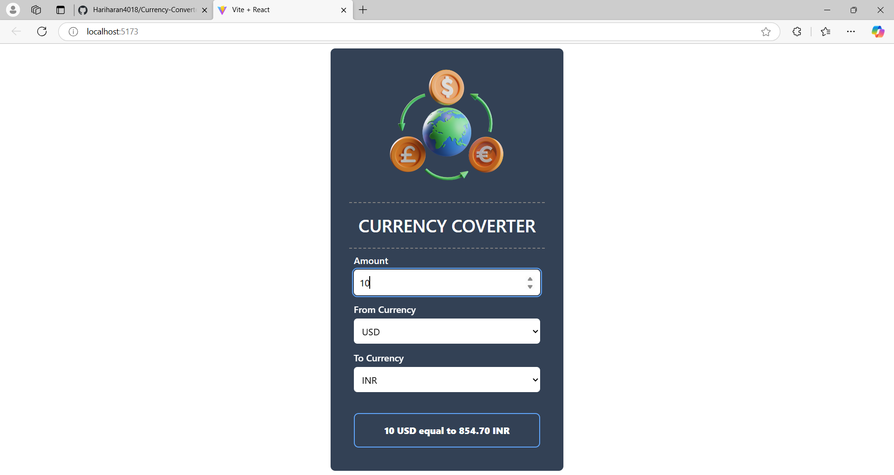
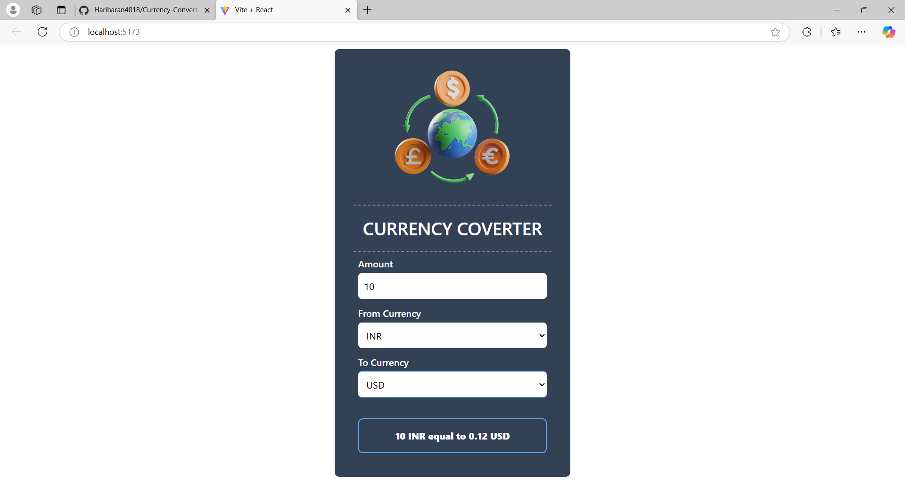

# Currency Converter 💱  

## Description  
The Currency Converter is a lightweight application designed to help users convert amounts between different currencies in real-time. The app fetches live exchange rates from an external API and ensures accurate conversions for over 150 currencies.  

## Features  
- Convert amounts between multiple currencies.  
- Real-time exchange rates using a trusted API.  
- Simple, clean, and user-friendly interface.  
- Responsive design for both desktop and mobile devices.  

## Technologies Used  
- **Frontend**: Reactjs
- **API**: [ExchangeRate API](https://exchangerate-api.com/) (or any similar service)  
- **Libraries/Frameworks**: Axios (for API calls), Tailwind (for styling)  

## Installation  

### Prerequisites  
- Node.js installed on your system (optional for advanced setup).  
- API for currency exchange rate provider (e.g., [ExchangeRate API](https://exchangerate-api.com/)).  

### Steps  
1. Clone the repository:  
   ```bash  
   git clone https://github.com/Hariharan4018/Currency-Converter.git  
   ```  

2. Navigate to the project directory:  
   ```bash  
   cd currency-converter  
   ```  

3. Open the `index.html` file in your browser or start a local server if using Node.js.  
 
   ```  

## Usage  
1. Select the currencies to convert (e.g., USD to EUR).  
2. Enter the amount in the input field to get the converted value.  

## Screenshots  
### Conversion Page  
  

  

  

## Future Enhancements  
- Add support for cryptocurrencies.  
- Include historical exchange rate trends.  
- Add a currency calculator feature for bulk conversions.  


## Acknowledgments  
- [ExchangeRate API](https://exchangerate-api.com/) for live exchange rates.  
- Inspired by financial tools available online.  
